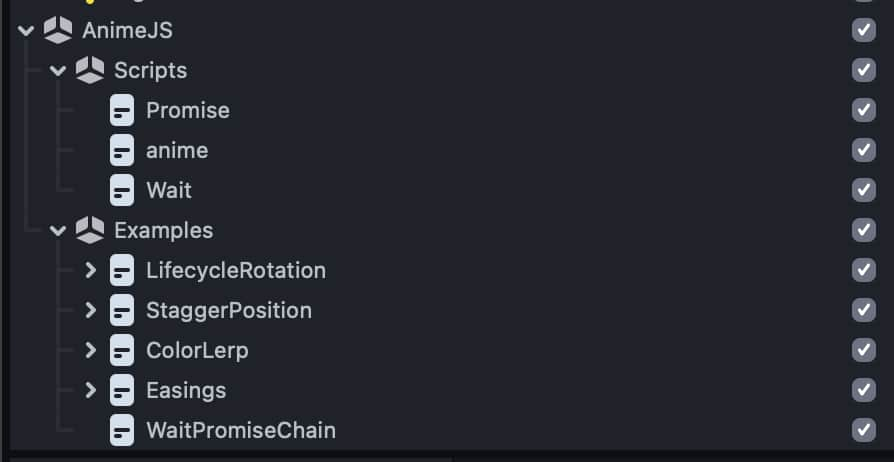
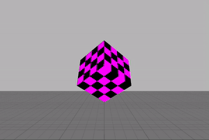

# AnimeJS for Lens Studio

This project ports the amazing [anime.js](https://github.com/juliangarnier/anime) library into [Lens Studio](https://ar.snap.com/lens-studio), and adds some convenience methods for interfacing with native Lens Studio objects. 

<h1 align="center">
  <a href="https://animejs.com"></a>
  <br>
  anime.js (for Lens Studio)
</h1>


## Installation

Download [anime.js.lso](./anime.js.lso) and drop it into your project to install it. It will show some examples by default. 



## Examples

Here's an example of a simple turntable animation: 

```javascript
var transform = script.getTransform()
anime({
  targets: transform.getLocalRotation().toEulerAngles(),
  y: Math.PI * 2,
  loop: true,
  easing: 'linear',
  duration: 3,
  update: anime.utils.updateLocalEuler(transform),
  begin: function () {
    print('begin')
  },
  complete: function () {
    print('complete')
  },
})
```



Here are the code examples included in the LSO. 

- [Lifecycle & rotation](./Public/AnimeJS%20Resources/Scripts/Examples/LifecycleRotationExample.js)
- [Color lerp](./Public/AnimeJS%20Resources/Scripts/Examples/ColorLerpExample.js)
- [Easings](./Public/AnimeJS%20Resources/Scripts/Examples/EasingsExample.js)
- [Stagger position](./Public/AnimeJS%20Resources/Scripts/Examples/StaggerPositionExample.js)
- [Timeline & screen transforms](./Public/AnimeJS%20Resources/Scripts/Examples/TimelineExample.js)
- [`wait()` utility functions](./Public/AnimeJS%20Resources/Scripts/Examples/WaitPromiseChainExample.js)


## Documentation

anime.js has great documentation, and most of what you need to know will be found there. https://animejs.com/documentation/

There are some extra properties and functions that are specific to the Lens Studio port, which can be found at the bottom of the [anime.js](/Public/AnimeJS%20Resources/Scripts/anime.js) script. These are documented with docstrings so you can see the required arguments and properties in the code hints (via vscode extension).

`anime.easings`: list of all [Penner functions](https://animejs.com/documentation/#pennerFunctions) for easing for convenient referencing and autocompletion.

`anime.utils.updateLocalPosition(transform)`: Generates an update handler for local position.

`anime.utils.updateWorldPosition(transform)`: Generates an update handler for world position.

`anime.utils.updateLocalEuler(transform)`: Generates an update handler for local euler rotation.

`anime.utils.updateWorldEuler(transform)`: Generates an update handler for world euler rotation.

`anime.utils.updateProp(target, propName)`: Generates an update handler that reassigns the vec3 so changes are applied.

A [Promise polyfill](/Public/AnimeJS%20Resources/Scripts/Promise.js) is also included since it's required by anime.js.


## Motivation

We use anime.js in web projects, so it was already part of our workflow. Instead of needing to learn a completely new animation system (e.g. [TweenManager](https://docs.snap.com/lens-studio/references/guides/lens-features/adding-interactivity/helper-scripts/tween-manager#adding-the-tween-package)), we opted to port anime.js. In general it's a more script-focused approach than the Tween.js implementation. We found it simpler to orchestrate a lot of animations in script, as opposed to components. 

To illustrate, here's what one of our animation control scripts might look like, using anime.js and Promises. It's easy to understand, and easy to comment out large blocks for testing specific sections. 

```
hideIntroInstructions()
  .then(showTitleCard)
  .then(showHandInstruction)
  .then(waitForHandTracking)
  .then(sprinkleConfetti)
  .then(highFive)
  .then(waitf(2))
  .then(showLogo)
  .then(function () { print('done!') })
```
